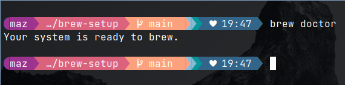

# Linux Homebrew Installer

This script automates the installation of Homebrew on various Linux distributions based on their package managers.

## What is Homebrew (Brew)?

Homebrew (often referred to as brew) is a package manager for installing software on macOS, Linux, and other Unix-like operating systems. It simplifies the process of installing software by automating the download, installation, and management of packages, making it easier to maintain software on your system.

## Description

The `brew-setup.sh` script is designed to detect the Linux distribution type (Arch-based, Debian-based, or Linux Mint) and execute the appropriate commands for installing Homebrew.

## Installation

1. Clone the repository `https://github.com/AvhiMaz/brew-setup.git`
2. Change the Directory `cd brew-setup`
3. Run the script: `./brew-setup.sh`

## Supported Distributions

- Arch-based systems (detected via `/etc/arch-release`)
- Debian-based systems (including Ubuntu, Linux Mint, detected via `/etc/debian_version` or `/etc/linuxmint/info`)
- More Distributions are adding soon... :)

## Usage

Run the script and follow the on-screen instructions. It will automatically identify your Linux distribution type and install Homebrew accordingly.

## Contributions

Contributions are welcome! Feel free to fork this repository, make changes, and submit pull requests.

## Acknowledgements

- The script is inspired by the Homebrew on Linux project.

